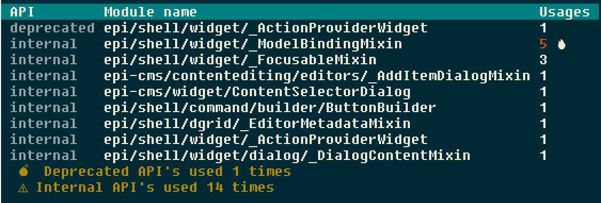

# Formatters

There are several formatters and they can be used with the `-f` flag when calling ESLint. They reside in `./node_modules/@episerver/eslint-formatter-cms/lib/`.

## Summary format

Usage:

```
$ eslint . -f @episerver/cms/lib/summary
```

Result:




## Table format

Used by the `summary` formatter.

Usage:

```
$ eslint . -f @episerver/cms/lib/table
```


## CSV format

This is the preferred format if you want to send us your usage. Outputed file can be commited to track progress in lowering usage of internal and deprecated API's.

Usage:

```
# Output to console
$ eslint . -f @episerver/cms/lib/csv

# Output to file
$ eslint . -f @episerver/cms/lib/csv -o epi-module-usage.csv
```

Result:

```csv
Rule,Module name,Usage count
no-deprecated-episerver-apis,epi/shell/widget/_ActionProviderWidget,3
no-deprecated-episerver-apis,epi-cms/store/CustomQueryEngine,2
no-internal-episerver-apis,epi-cms/contentediting/NotificationBar,8
no-internal-episerver-apis,epi/shell/widget/_ModelBindingMixin,8
```


## JSON format

Outputed file can be commited to track progress in lowering usage of internal and deprecated API's.

Usage:

```
# Output to console
$ eslint . -f @episerver/cms/lib/json

# Output to file
$ eslint . -f @episerver/cms/lib/json.js -o epi-module-usage.json
```

Result:

```json
[
    {
        "rule": "no-deprecated-episerver-apis",
        "violations": [
            {
                "module": "epi/shell/widget/_ActionProviderWidget",
                "usages": 3
            },
            {
                "module": "epi-cms/store/CustomQueryEngine",
                "usages": 2
            }
        ]
    },
    {
        "rule": "no-internal-episerver-apis",
        "violations": [
            {
                "module": "epi-cms/contentediting/NotificationBar",
                "usages": 8
            },
            {
                "module": "epi/shell/widget/dialog/ErrorDialog",
                "usages": 17
            },
        ]
    }
]
```
